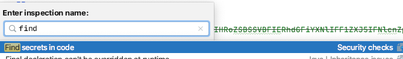
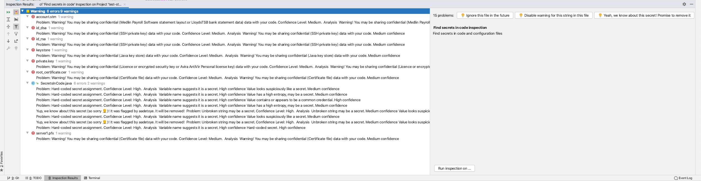
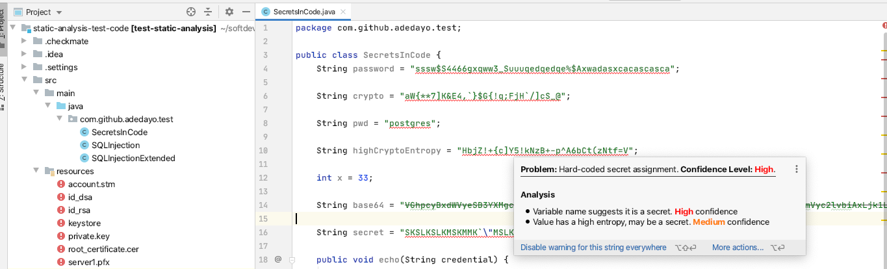
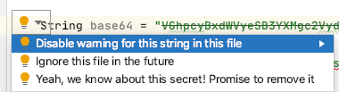

# CheckMate Security Analysis Plugin for IntelliJ

CheckMate (https://github.com/adedayo/checkmate) is a static security analysis tool. This repository
contains code for the IntelliJ plugin wrapper that allows CheckMate to be used within IntelliJ IDEs.

## Installation
The plugin will be published in the usual JetBrain IntelliJ plugin marketplace and can be installed
in the usual manner. 

However it may also be installed from here 
https://github.com/adedayo/intellij-checkmate-plugin/releases by downloading a version to your disk
and within your IntelliJ IDE go to _Preferences → Plugins_ the click on the button "Install plugin from disk..."
 
 
 
 
 and select the zip file you just downloaded. You may need to restart your IDE.
 
 ## Usage
 
 The IntelliJ plugin is implemented as a set of code inspection and annotators. 
 To invoke an inspection press  Ctrl+Alt+Shift+I  (Cmd+Alt+Shift+I on macos) and search for its description. 
 
 
 
 Alternatively, you can find them under the menu _Analyze → CheckMate Security → Find Secrets_
 
 Select the scope of search and run the scan. You will get annotated results similar to the following
 
 
 
 Each result comes with diagnostic information such as
 
 
 Each issue found also provides diagnostics that could be used to ignore the issue or file for future scans, 
 or to annotate the issue as a "TODO" for a future fix whithout suppressing it from the results.
  